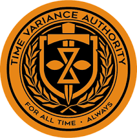

# Time Variance Authority (TVA)

  

## 📺 Introduction

Welcome to the Time Variance Authority (TVA) — the watchdog of time tracking! This automated system ensures that no Clockify entries go missing and keeps an eye out for any unusual time anomalies.

With automated updates delivered straight from the Clockify API to Slack, TVA helps maintain transparency and accountability across the timeline. Whether it's a missed entry or a suspicious log, we've got it covered.

## ✨ Purpose

- Detect and highlight missing Clockify entries
- Identify and flag suspicious time entries for review
- Ensure everyone's timeline stays clean and accurate
- Provide daily and monthly reporting through Slack

## 🛠 Technical Overview

### Architecture

- AWS Lambda Functions
- Clockify API Integration
- Slack Notifications
- Node.js Runtime

### Scheduled Runs

- **Daily Check**: Runs at 4:30 AM (Mon-Fri)
- **Monthly Report**: Runs at 11:30 AM (Every Monday)

## 👥 The Time Keepers

- Yash Vekaria
- Harish Vaja

## 📋 Time Keeper Ordinance

### 🕒 Time Requirements

- Minimum 8 hours per working day required
- Previous working day is checked daily
- Gaps greater than 4 hours trigger alerts
- Single entries longer than 10 hours are flagged as suspicious

### 📅 Working Days

- Monday to Friday only
- Weekends (Saturday & Sunday) excluded
- Configurable holidays excluded

### 🔔 Monitoring & Alerts

The system monitors for:

- Missing hours (less than 8 hours/day)
- Long duration entries (exceeding 10 hours)
- Large gaps (more than 4 hours between entries)
- Overlapping time entries

## ⚙️ Configuration

### Environment Variables

- `CLOCKIFY_API_KEY`: Your Clockify API key
- `SLACK_BOT_TOKEN`: Slack bot token for notifications
- `SLACK_CHANNEL_ID`: Target Slack channel for notifications
- `HOLIDAYS`: Comma-separated list of holidays in YYYY-MM-DD format
- `USERS`: JSON string containing user configurations

## 🎯 Features

### Daily Reports

- Automated checks for the previous working day
- Individual time entry analysis
- Immediate Slack notifications for discrepancies

### Monthly Reports

- Comprehensive team-wise summaries
- Total hours tracked per team
- Progress tracking against expected hours

## 🔄 Workflow

1. Fetches time entries from Clockify
2. Analyzes entries for discrepancies
3. Groups data by teams when needed
4. Sends formatted reports to Slack
5. Handles rate limiting and error recovery

## 🚀 "For all time, always."

TVA ensures temporal compliance in time tracking, maintaining order across all timelines!
